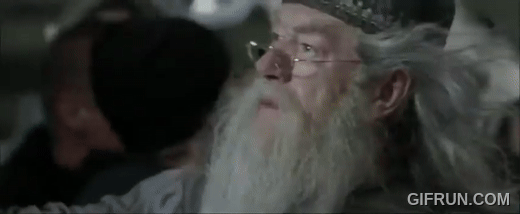

# DIY Transformer

A pedogical implementation of a decoder-only transformer from scratch.

---

Install dependencies:


```bash
python -m venv diyt
source diyt/bin/activate
pip install -r requirements.txt
pip install -e .
```

To be able to run jupyter notebooks:

```bash
pip install ipykernel
python -m ipykernel install --user --name diyt --display-name "Python (diyt)"
```

---

## Experiment: Overfit to Harry Potter Corpus



Find data in `data/harry_potter.txt`

To train:

```bash
python src/diyt/pre_train.py
```

See notebook `notebooks/playground.ipynb` for generation.

TODO:
- [ ] Implement KV caching
